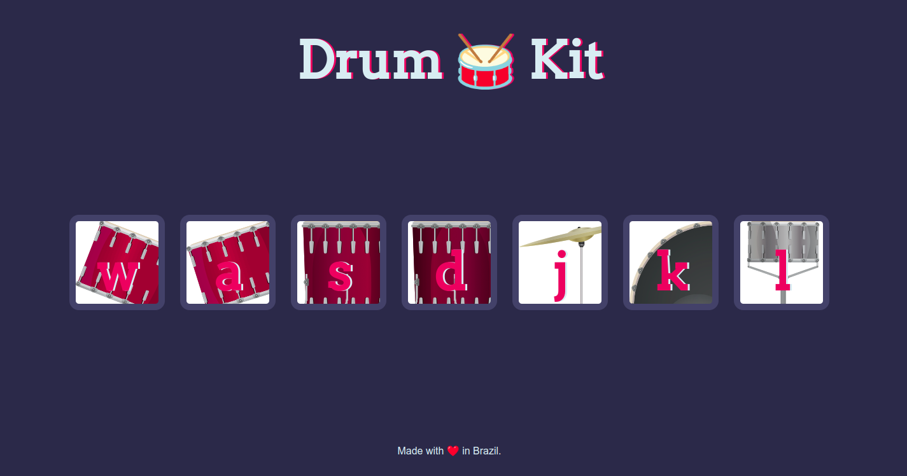

# Drum Kit Virtual 🎵

Este projeto é uma página interativa que transforma o teclado em uma bateria virtual! Letras correspondem a diferentes partes da bateria, e ao pressionar uma delas, o som correspondente é reproduzido.

Este projeto foi desenvolvido para aprimorar meus conhecimentos em JavaScript, especialmente na manipulação do DOM, no uso de estruturas como o laço for, eventos como keydown, e no trabalho com o objeto Audio.

Além de ser uma experiência prática divertida, o projeto ajudou a consolidar conceitos fundamentais de programação e interatividade na web.



## 🚀 Começando

Essas instruções permitirão que você obtenha uma cópia do projeto em operação na sua máquina local para fins de desenvolvimento e teste.

Consulte **[Clonando o projeto](#-clonando-o-projeto)** para saber como implantar o projeto.

## 🔧 Clonando o Projeto

### 1. Primeiro passo

Clone o reposítorio para seu ambiente local

```bash
git clone https://github.com/Le-Jr/drumJs-project.git
cd drumJs-project
```

### 2 Editando o projeto

Abra o projeto no seu editor de código e edite o projeto a sua maneira

## 🛠️ Construído com

Tecnologias utilizadas no projeto:

[](https://skillicons.dev)

- [Html](https://developer.mozilla.org/en-US/docs/Web/HTML) - Usado para construir separar o conteúdo da página
- [Css](https://developer.mozilla.org/en-US/docs/Web/CSS) - Pré-processador Css utilizado para estilização
- [JavaScript](https://developer.mozilla.org/en-US/docs/Web/JavaScript) - Usado para construir separar o conteúdo da página
- [VS Code](https://code.visualstudio.com/) - IDE para construir a aplicação

## ✒️ Autor

<table>
  <tr>
    <td align="center">
      <a href"https://github.com/Le-Jr" title="Link Perfil Git Hub">
        <br>
        <sub>
          <b>Leandro Junior - Le-Jr</b>
        </sub>
      </a>
    </td>
</table>

## 🎁 Expressões de gratidão

- Agradeço, especialmente à instrutora <a href="https://www.appbrewery.com/" target="_blank" >Dra Angela Yu</a>, pelo excelente curso que possibilitou a existência deste projeto

---

⌨️ com ❤️ por [Leandro Junior](https://github.com/Le-Jr) 😊
